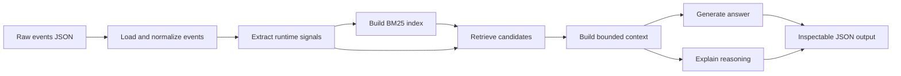
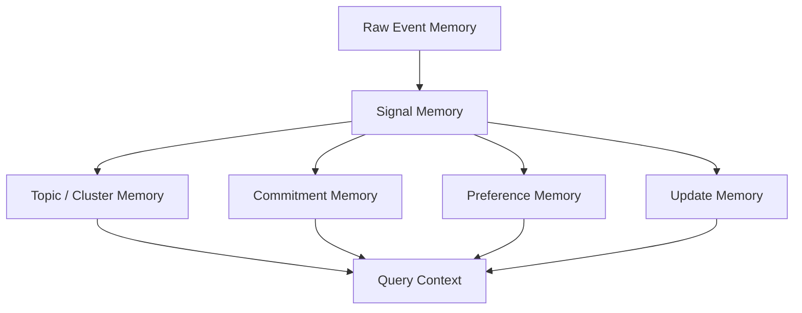
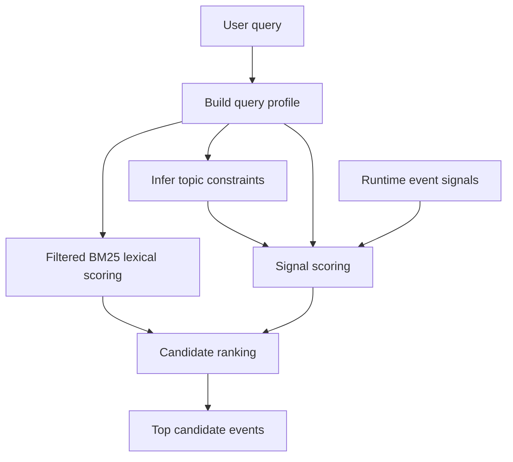
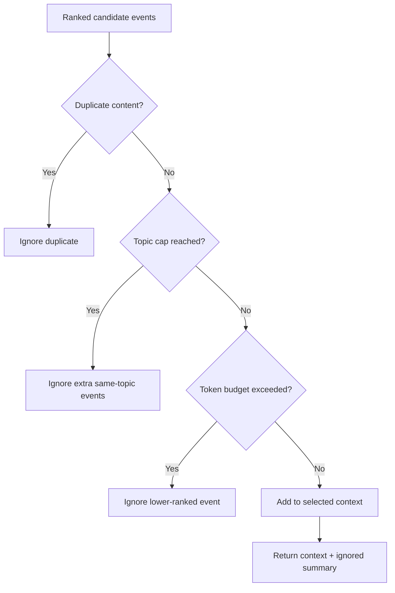
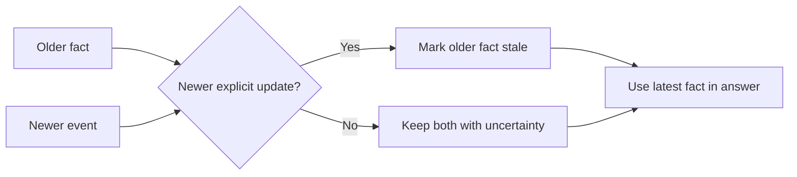
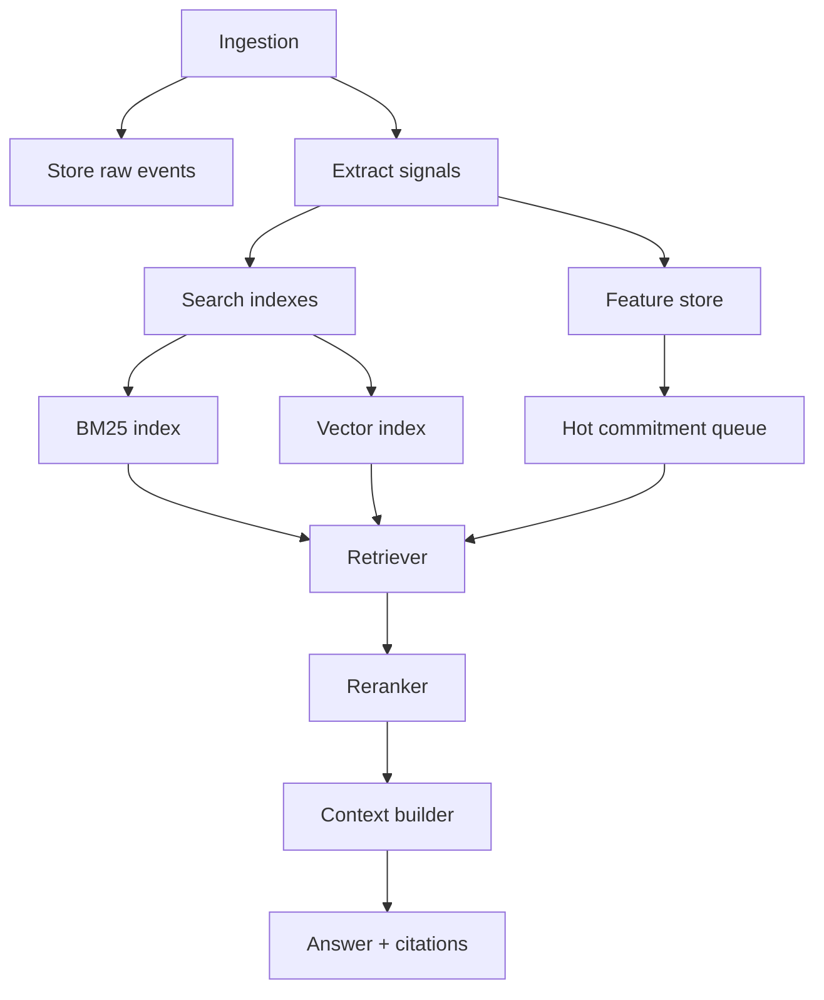
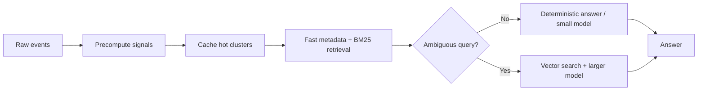

# Design Document

## 1. What This System Does

The dataset is a raw personal information stream. Each record has only:

```json
{
  "timestamp": "2026-04-01T09:12:00Z",
  "source": "whatsapp",
  "content": "..."
}
```

There are no labels, no task IDs, no memory flags, and no ground truth annotations. The system must infer what matters from the text, timestamp, and source.

The assessment asks the engine to answer questions such as:

- What should I focus on today?
- What commitments am I at risk of missing?
- What have I been procrastinating on?
- Summarize everything related to the UIE proposal.

The fixed scenario time is:

```text
2026-04-13T03:00:00Z
```

That means the system must reason about overdue items, today's work, stale facts, and future-facing events relative to that exact timestamp.

## 2. High-Level Architecture

The engine follows a simple pipeline:



The important design choice is that the dataset is not modified. All labels and structures are derived at runtime.

## 3. Runtime Memory Model

The system creates temporary memory layers from the raw events.



### Raw Event Memory

This is the original event with:

- Stable event ID
- Timestamp
- Source
- Content

Example:

```text
event_id=108
timestamp=2026-04-09T07:55:00Z
source=slack
content="#uieng Aarav: Ignore my earlier deadline note. UIE proposal is now due Monday Apr 13 15:00 IST, not Friday Apr 10."
```

### Signal Memory

Signals are derived facts such as:

- Topic: `uie_proposal`, `hiring_rubric`, `southridge_sow`
- Due date
- Scheduled date
- Action language
- Commitment language
- Update/correction language
- Noise indicator
- Urgency score

These are not written back into the dataset.

### Topic / Cluster Memory

Related events are grouped into workstreams. Examples:

| Cluster | Examples of matching signals |
| --- | --- |
| `uie_proposal` | UIE, Nina, appendix, rollback, procurement, SOC2, retry budget |
| `hiring_rubric` | rubric, senior/junior split, interview calibration |
| `southridge_sow` | Southridge, SOW, redlines, clause 8 |
| `mom_cardiology` | Mom, cardiology report, appointment |
| `incident_doc` | incident doc, prevention section, rollback drill |

### Commitment Memory

The engine treats messages with words like "due", "before", "promised", "please send", "need", or "I owe" as possible commitments.

Example:

```text
Hiring rubric was due Apr 12. Please send the senior/junior scoring split by noon.
```

### Preference Memory

Some events describe preferences that affect answer quality.

Example:

```text
Nina dislikes architecture-heavy docs; she reads risk, rollout plan, and decision owner first.
```

This matters when summarizing the UIE proposal because it tells the engine what Nina wants.

### Update Memory

Some events override earlier facts.

Example:

```text
Ignore my earlier deadline note. UIE proposal is now due Monday Apr 13 15:00 IST, not Friday Apr 10.
```

This makes the Apr 10 deadline stale.

## 4. Retrieval Architecture

Retrieval is hybrid. It combines simple lexical search with business signals.



### Step 1: Build Query Profile

The engine first creates a small query profile:

- Filtered query terms, with stopwords removed before lexical scoring.
- Broad intent such as focus, risk, procrastination, summary, or generic.
- Inferred topic constraints from overlap between the query terms and event-derived topic terms.

The intent is intentionally broad. It decides which features matter, but it does not name the expected answer.

| Intent | Query example |
| --- | --- |
| `today_focus` | What should I focus on today? |
| `risk_missing` | What commitments am I at risk of missing? |
| `procrastination` | What have I been procrastinating on? |
| `topic_summary` | Summarize everything related to the UIE proposal. |
| `generic` | Any other question |

### Step 2: Infer Topic Constraints

Topic constraints are inferred from the underlying event data, not from expected questions.

For each derived topic cluster, the engine builds a term profile from events in that cluster. A query like:

```text
Summarize Southridge SOW status
```

matches the `southridge_sow` cluster because Southridge/SOW terms occur in that cluster. A broad query like:

```text
What commitments am I at risk of missing?
```

does not infer a topic just because the word "risk" appears inside UIE events. Intent words such as risk, focus, today, summary, and procrastination are excluded from topic inference.

### Step 3: Score With BM25

BM25 gives lexical recall. It uses filtered query terms and inferred topic labels, so stopwords do not accidentally make unrelated messages look relevant.

### Step 4: Score With Signals

BM25 alone is not enough. A random Slack message can match a word but still be useless.

The signal scorer boosts:

- Due or overdue commitments
- Current-day calendar events
- Topic matches
- Updates and corrections
- Dependency/blocker language such as "waiting on" or "depends on"
- Repeated nudge language for procrastination queries
- Explicit consequences such as "late fee" or "release the slot"

The scorer downranks:

- Newsletters
- Receipts
- OTPs
- Random channel chatter
- Old background facts
- Old overdue facts that are likely stale after newer updates
- Future non-calendar messages that the user may not have seen yet

## 5. Context Construction Strategy

The assessment says production may have:

- 10k messages
- 1k notes
- 500 reminders
- 100k-token context budget

The right strategy is not to fill the whole budget. The system should choose the smallest useful context.



The context builder uses:

- Maximum selected event count
- Estimated token budget
- Duplicate-content removal
- Topic caps
- Ignored-context diagnostics

For this dataset:

| Query type | Typical selected context |
| --- | --- |
| Today focus | Around 18 events |
| Risk of missing commitments | Around 20 events |
| Procrastination | Around 18 events |
| Topic summary | Around 22 events |

Topic-summary queries get more records because the user asked for "everything related" to a single cluster.

## 6. Contradiction And Recency Handling

The engine treats newer explicit updates as stronger than older facts.



Concrete examples from the dataset:

| Topic | Older fact | Newer update | Final interpretation |
| --- | --- | --- | --- |
| UIE deadline | Due Apr 10 | Now due Apr 13 15:00 IST | Use Apr 13 |
| UIE review | Review Apr 10 | Review moved to Apr 13 14:30 IST | Use Apr 13 review |
| Procurement | Old estimate `$42k` | Updated estimate `$48.5k` | Use `$48.5k` |
| Data-room access | May depend on procurement | Waiting on external-safe diagrams | Use diagrams as blocker |
| Southridge clause 8 | Blocked on legal | Clause 8 approved | No longer blocked |
| UIE work block | Apr 12 work block | Apr 12 block cancelled | Do not rely on Apr 12 block |

The output includes these resolutions in the `reasoning` section.

## 7. Answer Generation

This implementation uses deterministic extractive synthesis, not fixed answer templates.

Why deterministic extractive answers?

- No external API key is required.
- The reviewer can run it offline.
- The answer is stable across runs.
- The selected context and reasoning are easy to inspect.

For summaries, the answer is assembled from selected events into sections such as latest updates, deadlines/calendar anchors, open asks/dependencies, and preferences/background. For focus/risk/procrastination queries, selected events are grouped by topic and presented in ranked order.

In production, the final prose could be generated by an LLM using the same selected context. The retrieval, context, and reasoning layers should remain inspectable even if the answer text is model-generated.

### Example: UIE Proposal Answer

The UIE answer includes:

- Latest deadline: Apr 13 15:00 IST
- Review: Apr 13 14:30 IST
- External naming: Unified Intelligence Engine
- Nina's preferred format
- Required appendix items
- Updated procurement estimate
- Retry-budget dependency
- Ravi/data-room dependency
- Open uncertainty: no final sent-confirmation exists

## 8. Failure Modes

No personal-memory system is perfect. Main risks:

| Failure mode | Example | Mitigation |
| --- | --- | --- |
| Ambiguous dates | "Tuesday appointment" without exact date | Use nearby calendar records when available |
| Missing completion events | User may have finished a task outside the stream | Say completion is uncertain |
| Future timestamps | Some dataset events are after scenario time | Downrank future non-calendar messages |
| Topic ambiguity | "redlines" could mean different workstreams | Require nearby anchor terms such as Southridge or SOW |
| Stale summaries | Cached topic summary may miss a new update | Keep raw-event citations and refresh hot clusters |
| Extractive answer limits | Deterministic snippets can be less fluent than model-written prose | Use an LLM only after retrieval, with selected context and citations preserved |

## 9. Scaling Plan

For 10k messages, 1k notes, and 500 reminders:



Production changes:

- Store raw events in an append-only event log.
- Persist extracted signals with confidence and provenance.
- Maintain BM25 and vector indexes.
- Keep a hot queue for upcoming commitments and stale tasks.
- Build rolling summaries per topic, but keep citations to raw events.
- Use a lightweight reranker for the top 100-200 candidates.
- Use per-cluster context budgets so one noisy topic does not dominate.

## 10. Optimization Question

If latency must be under 2 seconds and cost must drop by 80%, change the system like this:



Concrete changes:

- Precompute topics, due dates, updates, and rolling summaries at ingestion time.
- Cache common query outputs such as "today" and "what am I missing?"
- Use metadata filters and BM25 first.
- Use embeddings only when lexical retrieval is not enough.
- Route simple deadline questions to deterministic code or a small model.
- Use a larger model only for ambiguous, high-value, or conflict-heavy answers.
- Keep hot memories in a fast store and old raw events in cheaper storage.

Tradeoff:

- Latency and cost improve.
- Rare or subtle queries may lose recall if summaries are stale or embeddings are skipped too aggressively.
- To protect quality, keep citations, contradiction rules, and uncertainty fields in every answer.
