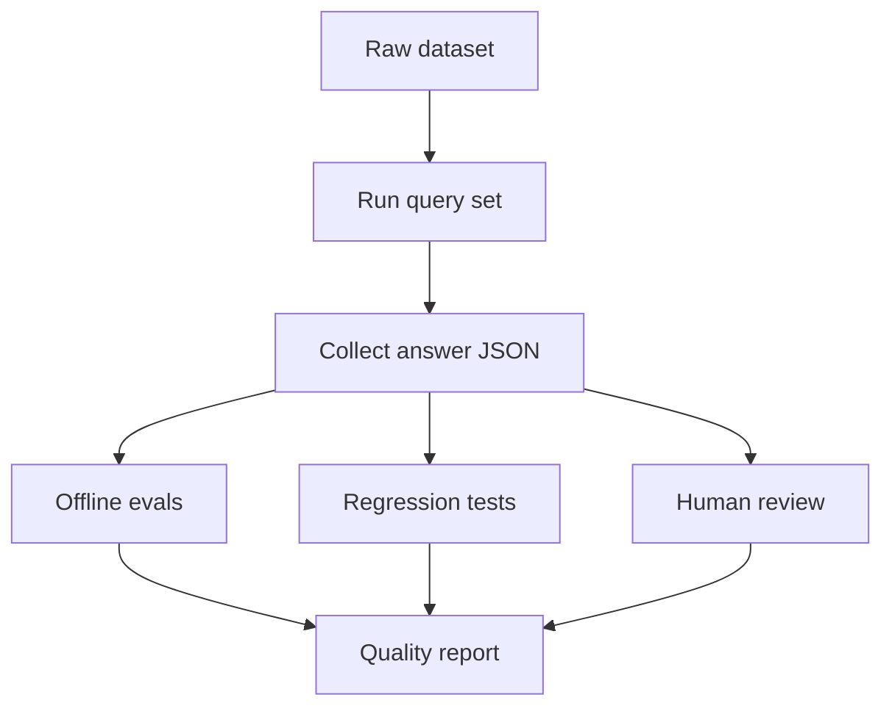
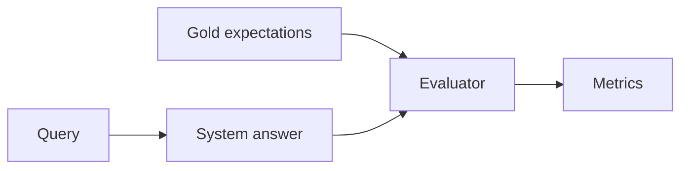
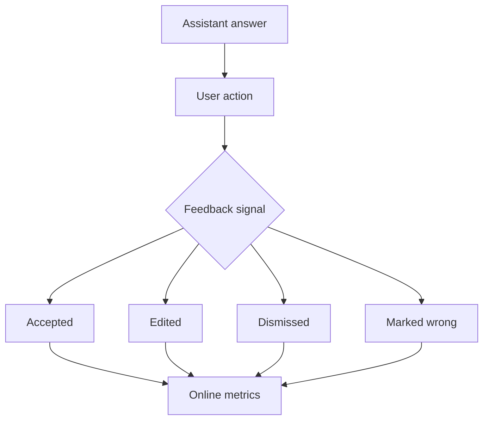
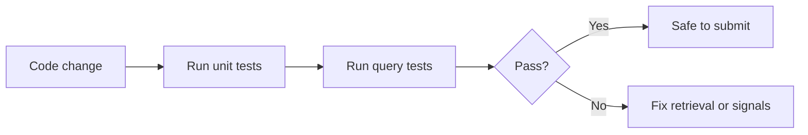

# Evaluation Framework

## 1. Goal

The system should not only "sound good." It should help the user act on the right memories at the right time.

For this assessment, evaluation should answer three questions:

1. Did the system retrieve the right events?
2. Did the answer use those events correctly?
3. Did it avoid stale, noisy, or misleading information?

## 2. Evaluation Overview



There are three evaluation layers:

| Layer | Purpose |
| --- | --- |
| Offline evals | Check quality against expected facts and stale facts. |
| Online evals | Measure whether users accept and act on recommendations. |
| Regression tests | Prevent known bugs from coming back. |

## 3. What A Good Answer Means

For a subjective question like:

```text
What should I focus on today?
```

a good answer should be:

| Quality | Meaning |
| --- | --- |
| Time-aware | Uses `2026-04-13T03:00:00Z` and IST deadlines correctly. |
| Prioritized | Puts urgent and important work first. |
| Grounded | Every important claim maps to selected events. |
| Update-aware | Uses newer corrections instead of stale facts. |
| Selective | Avoids newsletters, receipts, OTPs, and random chatter. |
| Useful | Gives concrete next actions and dependencies. |
| Honest | Says when completion status is uncertain. |

## 4. Offline Evaluation

Offline evals use a small gold set. The gold set should not modify the dataset. It should live separately as expected facts, stale facts, and ranking expectations.



### Example Gold Expectations

#### Query: Summarize everything related to the UIE proposal

Required facts:

- Latest due date is Apr 13 15:00 IST.
- Nina review is Apr 13 14:30 IST.
- External name is Unified Intelligence Engine.
- Updated procurement estimate is `$48.5k`.
- Appendix needs data retention, SOC2 wording, and procurement estimate.
- Proposal needs failure modes.
- Retry-budget decision must be written before sub-2s retrieval claims.
- Ravi/data-room access depends on external-safe diagrams.
- No event confirms final proposal delivery.

Stale facts to avoid:

- Do not present Apr 10 as the current due date.
- Do not present `$42k` as the current estimate.
- Do not say data-room access is blocked on procurement after the Apr 12 update.

#### Query: What should I focus on today?

Expected priority:

1. UIE proposal and appendix.
2. Hiring rubric, because it is already late.
3. Near-term commitments such as Southridge, Mom cardiology summary, dental confirmation, apartment payment, and incident doc closure.

#### Query: What commitments am I at risk of missing?

Expected items:

- UIE proposal/appendix.
- Hiring rubric.
- Southridge SOW redlines.
- Mom cardiology report summary.
- Dental confirmation.
- Apartment maintenance payment.
- Car insurance renewal.

#### Query: What have I been procrastinating on?

Expected patterns:

- Repeated nudges.
- "Still need" language.
- "Slips again" language.
- Old asks with no completion evidence.

Expected examples:

- Redlines.
- Admin export screenshots.
- School upload.
- Insurance renewal.
- Incident doc.
- UIE diagrams/data-room access.
- Hiring rubric.

### Offline Metrics

| Metric | Definition |
| --- | --- |
| Required-fact recall | Expected facts present in the answer / total expected facts. |
| Stale-fact precision | Superseded facts avoided or marked stale / total stale facts. |
| Citation coverage | Important answer claims supported by selected context. |
| Noise rejection | Selected context that is not random chatter, receipts, OTPs, or newsletters. |
| Priority agreement | Whether top answer items match expected priority order. |
| Token efficiency | Selected context tokens / available context budget. |
| Uncertainty quality | Whether missing completion evidence is stated clearly. |

## 5. Online Evaluation

Online evals measure whether the assistant helps the real user.



Useful product signals:

- User accepts a suggested priority.
- User clicks or opens selected source events.
- User marks a commitment as done, snoozed, irrelevant, or wrong.
- User edits the answer before using it.
- User asks "why did you show this?"
- User says "you missed X."
- Task completion time decreases after recommendations.

Online metrics:

| Metric | Meaning |
| --- | --- |
| Acceptance rate | How often the user accepts suggested priorities. |
| Edit rate | How often the user must correct the answer. |
| Dismissal rate | How often suggested items are irrelevant. |
| Missed urgent rate | Urgent items that should have appeared but did not. |
| False urgent rate | Low-priority items shown as urgent. |
| Stale update rate | Answers that use old facts after a newer update exists. |
| Source-open rate | How often users inspect selected evidence. |

## 6. Regression Tests

Regression tests protect known behavior.



Current implemented tests verify:

- Dataset loads all 200 events.
- UIE deadline update prefers Apr 13 over Apr 10.
- UIE review update prefers Apr 13 14:30 IST.
- Mom cardiology appointment keeps the correct Apr 14 date.
- Noisy random messages are marked as noise.
- Context builder dedupes repeated content.
- Context builder respects event and token limits.
- Required query outputs contain inspectable reasoning.
- UIE summary keeps key update events in selected context.
- Today focus avoids generic focus blocks.
- Risk query keeps due-soon personal deadlines.
- Broad risk queries do not accidentally infer a topic from intent words such as "risk".
- Unseen topic-summary queries, such as Southridge SOW status, use the inferred topic cluster.
- Topic-specific risk queries, such as the dental slot, can narrow ranking to the matching topic.
- Query profiling and candidate ranking are covered directly, not only through end-to-end engine tests.
- Candidate score breakdowns are exposed in selected context so ranking decisions can be audited and regression-tested.
- Ranker inputs are validated up front so missing or orphaned signal records fail fast instead of producing silent retrieval errors.

Run them with:

```bash
make test
```

## 7. Human Review Rubric

Each answer can be scored from 1 to 5.

| Dimension | 1 means | 5 means |
| --- | --- | --- |
| Relevance | Selected events do not answer the query. | Selected events directly support the answer. |
| Specificity | Answer is vague. | Answer names people, dates, blockers, and next actions. |
| Temporal correctness | Uses stale or wrong deadlines. | Correctly handles current time, due dates, and updates. |
| Context discipline | Dumps noisy or unrelated events. | Uses only useful context. |
| Uncertainty handling | Pretends unknown facts are known. | Clearly states what is uncertain. |

Production-acceptable answer:

- Average score is at least 4.
- No critical stale-fact error.
- High-impact claims have source evidence.
- The answer is useful enough for the user to act.

## 8. Example Evaluation Table

| Query | Must include | Must avoid |
| --- | --- | --- |
| UIE proposal summary | Apr 13 deadline, Nina review, `$48.5k`, Ravi diagram dependency | Apr 10 as current deadline, `$42k` as current estimate |
| Today focus | UIE, hiring rubric, near-term commitments | Random Slack chatter, generic saved links |
| Risk of missing | Overdue and due-soon commitments | Completed or superseded blockers |
| Procrastination | Repeated nudges and stale asks | One-off low-impact messages |

## 9. Cost And Latency Evaluation

If the product target becomes under 2 seconds and cost must drop by 80%, evaluation should also track:

| Metric | Why it matters |
| --- | --- |
| P50/P95 latency | User-facing responsiveness. |
| Retrieval latency | Whether search is the bottleneck. |
| Rerank latency | Whether reranking is too expensive. |
| Model cost per answer | Whether answer generation is affordable. |
| Cache hit rate | Whether common queries are being reused. |
| Quality after routing | Whether cheaper paths hurt answer quality. |

The main tradeoff is simple:

- More precomputation and caching reduces latency and cost.
- Too much caching can make answers stale.
- The system should preserve citations and update checks even on the cheap path.
