# Project Walkthrough

## 1. What Is This Project?

This project is a small personal-memory engine built for the Memorae AI Engineer assessment.

The input is one raw JSON dataset:

```text
data/memorae_mock_events.json
```

That file contains personal events from sources like Slack, Gmail, WhatsApp, calendar, Notion, reminders, SMS, and browser-saved links.

Each event looks like this:

```json
{
  "timestamp": "2026-04-01T04:45:00Z",
  "source": "whatsapp",
  "content": "Aarav: I promised Nina the UIE proposal v3 by Friday Apr 10 15:00 IST..."
}
```

There are no labels. The dataset does not say:

- This is a task.
- This is important.
- This is overdue.
- This belongs to the UIE proposal.
- This is stale.
- This is noise.

The system has to infer those things from the text and timestamp.

## 2. What Did The Assignment Ask?

The assignment asked us to build a working implementation that answers at least these four queries:

```text
What should I focus on today?
What commitments am I at risk of missing?
What have I been procrastinating on?
Summarize everything related to the UIE proposal.
```

It also asked us to use this scenario time:

```text
2026-04-13T03:00:00Z
```

That means when the system says "today", "overdue", or "urgent", it must judge everything relative to Apr 13, 2026 at 03:00 UTC.

## 3. What Is The Main Idea?

The project works like this:

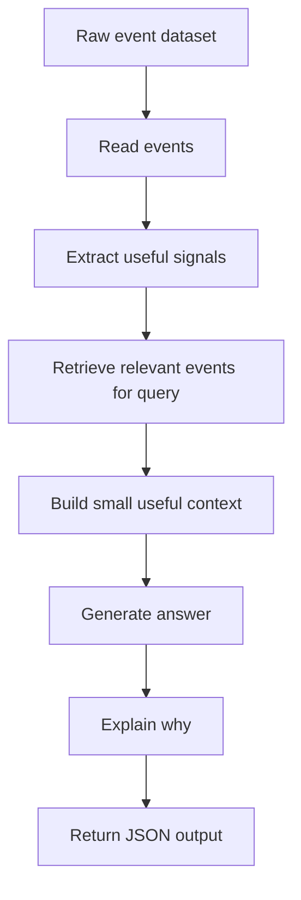

The important point:

The system does not simply dump all 200 events into the answer.

It first decides:

- Which events matter?
- Which events are noise?
- Which events are stale?
- Which events update older facts?
- Which events are urgent today?

Then it answers using only selected context.

## 4. What Files Matter?

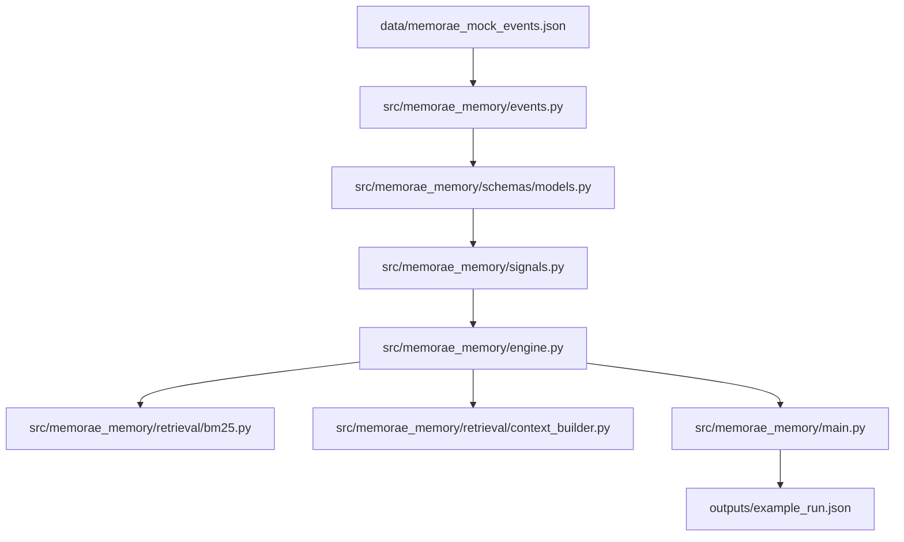

### Important Files

| File | What it does |
| --- | --- |
| `data/memorae_mock_events.json` | The raw dataset from the assignment. |
| `src/memorae_memory/events.py` | Loads JSON events and gives each event a stable ID. |
| `src/memorae_memory/schemas/models.py` | Defines the dataclass models used across the engine. |
| `src/memorae_memory/time_utils.py` | Handles UTC/IST date conversion and scenario time. |
| `src/memorae_memory/signals.py` | Extracts topics, deadlines, commitments, updates, noise, and urgency. |
| `src/memorae_memory/retrieval/bm25.py` | Performs simple keyword-style retrieval. |
| `src/memorae_memory/retrieval/context_builder.py` | Selects a small useful context from ranked events. |
| `src/memorae_memory/engine.py` | Main brain: retrieval, ranking, answer generation, reasoning. |
| `src/memorae_memory/main.py` | CLI entrypoint. |
| `outputs/example_run.json` | Example output for the required queries. |
| `docs/DESIGN.md` | Design document. |
| `docs/EVALUATION.md` | Evaluation framework. |
| `tests/` | Regression tests. |

## 5. Step-By-Step Flow

### Step 1: Load Events

File:

```text
src/memorae_memory/events.py
```

The system reads the dataset and converts every JSON object into an `EventRecord`.

Each event gets:

- `event_id`
- `timestamp`
- `source`
- `content`

Example:

```text
event_id=108
source=slack
content="#uieng Aarav: Ignore my earlier deadline note..."
```

Why event IDs matter:

They let the output explain exactly which records were used.

### Step 2: Extract Signals

File:

```text
src/memorae_memory/signals.py
```

This is where raw text becomes useful memory.

The system extracts:

- Topics
- Deadlines
- Calendar dates
- Action language
- Commitment language
- Update/correction language
- Preferences
- Noise
- Urgency

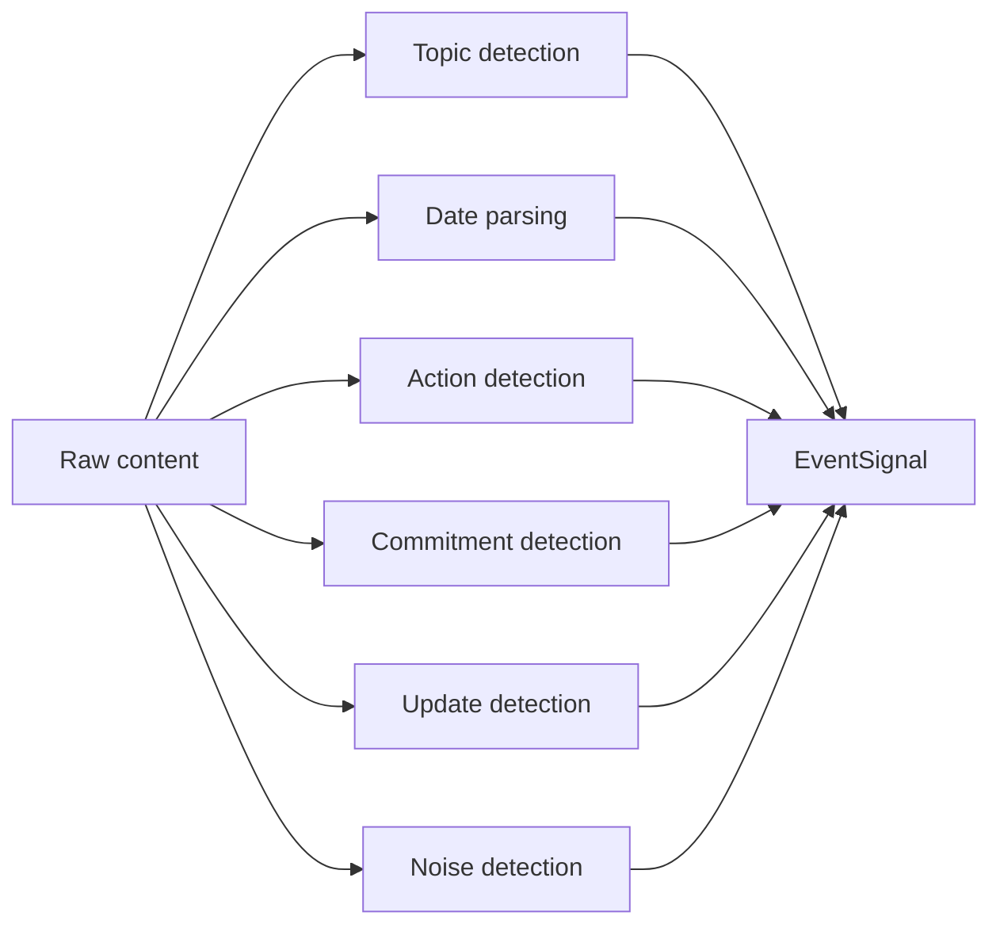

Example:

```text
"UIE proposal is now due Monday Apr 13 15:00 IST, not Friday Apr 10"
```

The system derives:

```text
topic = uie_proposal
due_at = 2026-04-13T09:30:00Z
is_update = true
is_commitment = true
```

### Step 3: Understand The Query

File:

```text
src/memorae_memory/engine.py
```

The query is converted into a query profile.

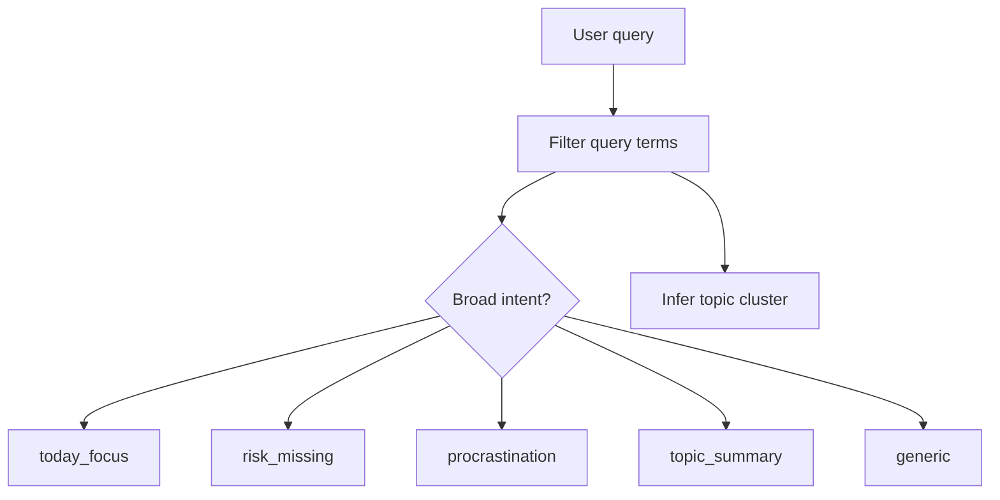

Examples:

| User query | Intent |
| --- | --- |
| What should I focus on today? | `today_focus` |
| What commitments am I at risk of missing? | `risk_missing` |
| What have I been procrastinating on? | `procrastination` |
| Summarize everything related to the UIE proposal. | `topic_summary` with inferred topic `uie_proposal` |
| Summarize Southridge SOW status. | `topic_summary` with inferred topic `southridge_sow` |

The intent matters because each question needs different ranking features, but the topic comes from query/event overlap rather than from a fixed list of assessment questions.

For example:

- "Today focus" should boost today's calendar and urgent deadlines.
- "Procrastination" should boost repeated nudges and old unfinished asks.
- "Summarize Southridge SOW status" should boost Southridge records even though it is not one of the required assessment queries.

### Step 4: Retrieve Candidate Events

Files:

```text
src/memorae_memory/retrieval/bm25.py
src/memorae_memory/engine.py
```

The retriever combines two things:

1. BM25 keyword search.
2. Signal-based scoring.

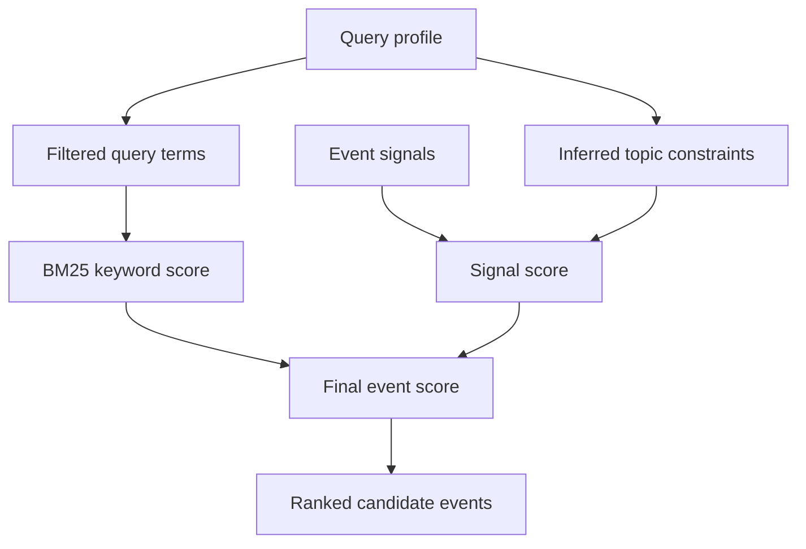

Why both are needed:

BM25 can find text matches, but it does not know what is urgent or stale.

Signal scoring adds product judgment.

For example:

- A random Slack message may match a word, but should be downranked.
- A deadline update should be boosted.
- An overdue task should be boosted.
- A newer correction should override old information.

### Step 5: Build Context

File:

```text
src/memorae_memory/retrieval/context_builder.py
```

The assignment says production could have a 100k-token context budget.

But the goal is not to use the biggest context.

The goal is to use the right context.

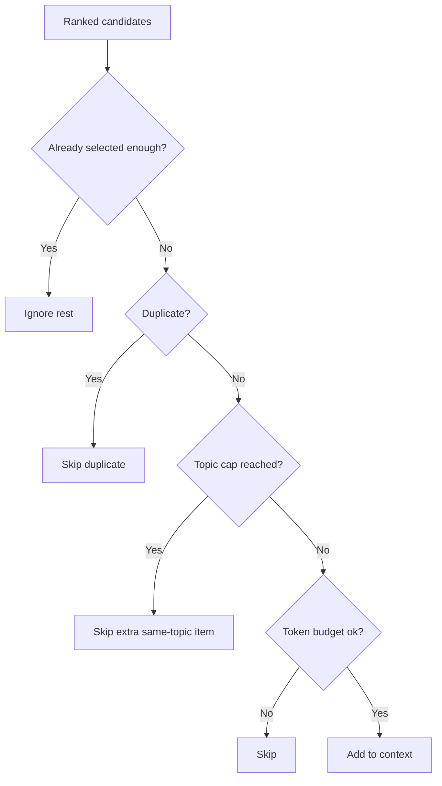

The context builder avoids:

- Repeated same content
- Too many events from one topic
- Too many tokens
- Low-ranked extra events

The final output also says what was ignored.

### Step 6: Generate Answer

File:

```text
src/memorae_memory/engine.py
```

The current implementation uses deterministic extractive synthesis.

That means:

- No OpenAI API key is needed.
- No external service is needed.
- The reviewer gets the same answer every run.
- The output is easy to inspect.

The answer is assembled from selected context rather than from a fixed answer body. Summaries are split into updates, deadlines/calendar anchors, open asks/dependencies, and preferences/background. Focus/risk/procrastination answers are grouped by ranked topic.

### Step 7: Explain Reasoning

Every answer includes:

- Which events were used.
- Why they were selected.
- Which clusters were used.
- What was ignored or downweighted.
- Which contradictions were resolved.
- What is uncertain.

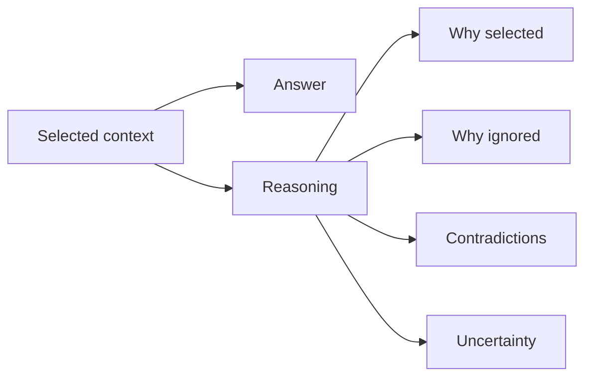

This is important because the assignment specifically asked for inspectable reasoning.

## 6. Example: UIE Proposal

The UIE proposal has many events across multiple days.

Important facts:

| Fact | Correct interpretation |
| --- | --- |
| Original deadline | Apr 10, but stale |
| Latest deadline | Apr 13 15:00 IST |
| Review time | Apr 13 14:30 IST |
| External name | Unified Intelligence Engine |
| Procurement estimate | `$48.5k`, not `$42k` |
| Data-room blocker | External-safe diagrams |
| Nina preference | Risk and rollout first, not architecture-heavy |

Contradiction handling:

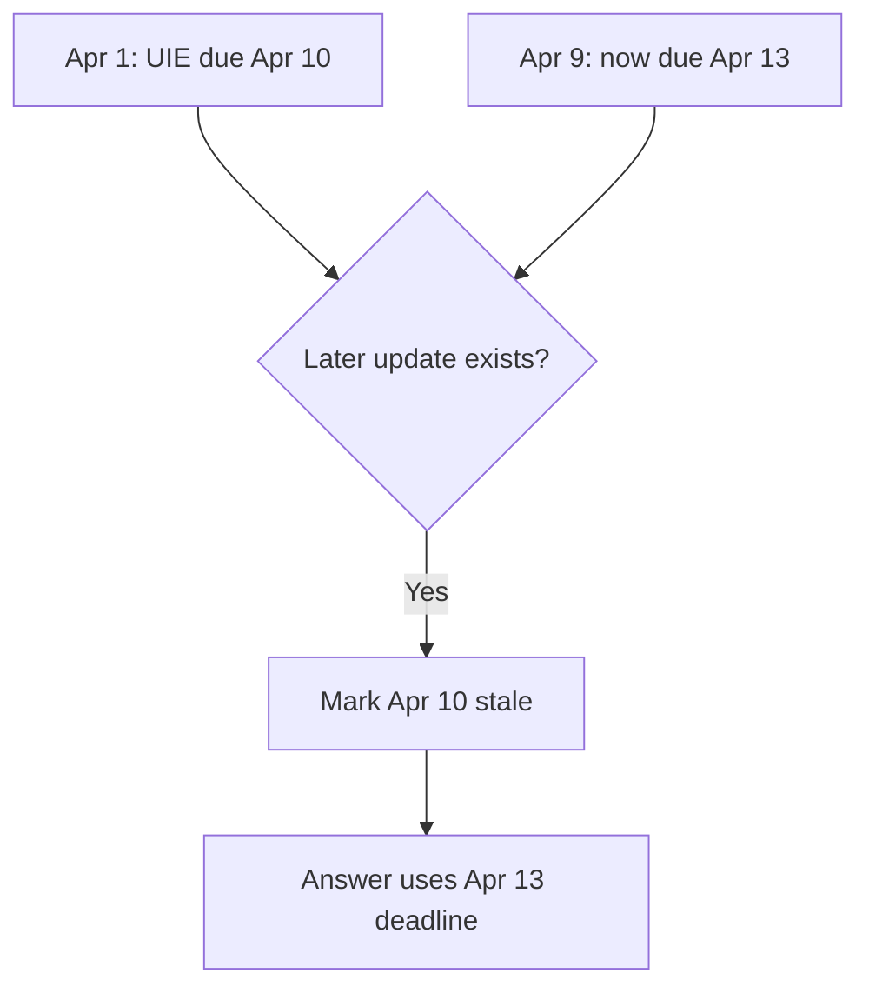

So the answer says:

```text
The latest deadline is Monday Apr 13 15:00 IST.
```

It does not say:

```text
The proposal is due Apr 10.
```

## 7. Example: Today Focus

Question:

```text
What should I focus on today?
```

The engine prioritizes:

1. UIE proposal and appendix.
2. Hiring rubric because it was due Apr 12.
3. Near-term personal and operational commitments.

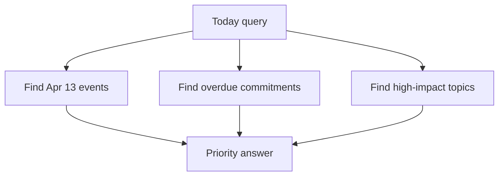

It downranks:

- Random Slack chatter
- Receipts
- OTPs
- Saved links
- Generic focus blocks that are not tied to a real task

## 8. Example: Procrastination

Question:

```text
What have I been procrastinating on?
```

The engine looks for:

- Repeated nudges
- "Still need"
- "Slips again"
- Old tasks without completion evidence
- Due dates that passed

Examples it finds:

- Southridge redlines
- Admin export screenshots
- School upload
- Insurance renewal
- Incident doc
- UIE diagrams/data-room access
- Hiring rubric

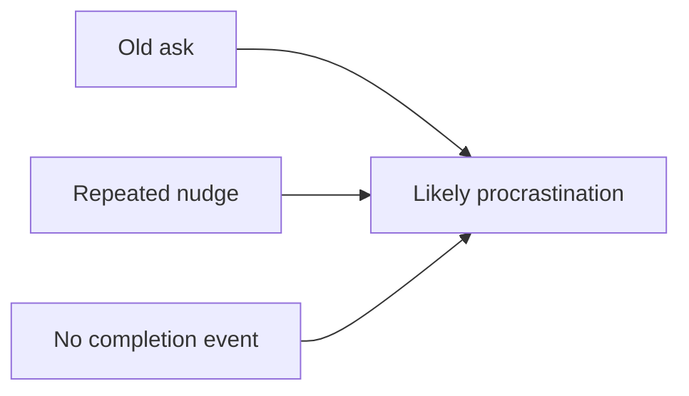

## 9. What You Have To Do As A Reviewer Or User

### Install

```bash
poetry install
```

### Run All Required Queries

```bash
make run
```

### Generate Output File

```bash
make example
```

This writes:

```text
outputs/example_run.json
```

### Run Tests

```bash
make test
```

### Run Lint

```bash
make lint
```

## 10. What To Submit

Submit the full project with:

```text
data/memorae_mock_events.json
src/memorae_memory/
tests/
docs/
outputs/example_run.json
README.md
pyproject.toml
poetry.lock
poetry.toml
Makefile
```

Do not submit generated local folders such as:

```text
.venv/
__pycache__/
.ruff_cache/
```

They are ignored by `.gitignore`.

## 11. Simple Mental Model

If you remember only one thing, remember this:

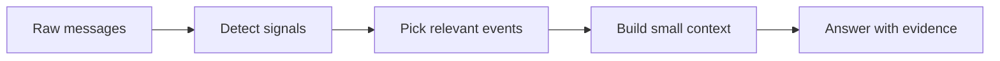

This project is not a chatbot over all messages.

It is a small memory-retrieval system that:

- Finds what matters.
- Ignores noise.
- Handles stale updates.
- Builds focused context.
- Answers with inspectable evidence.
